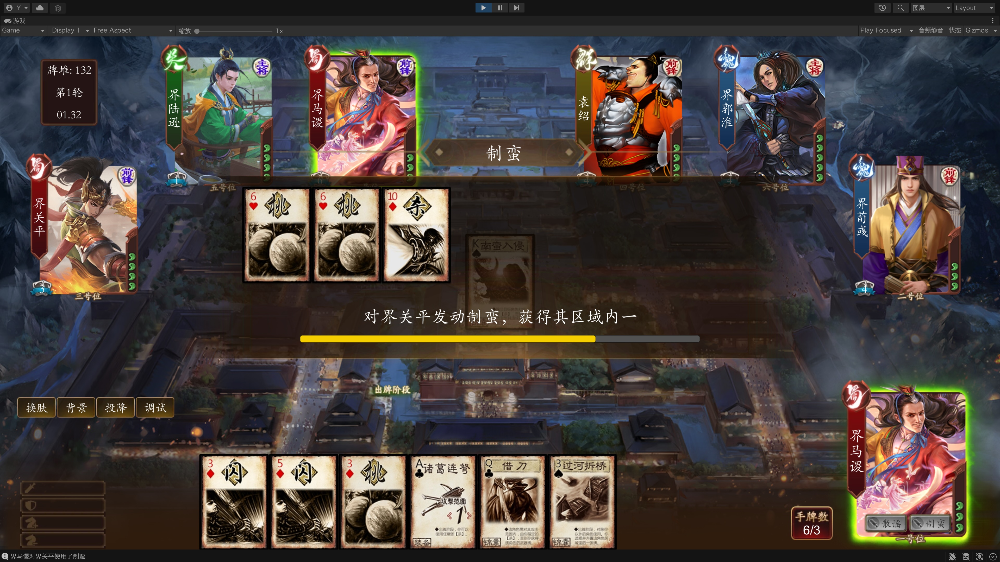
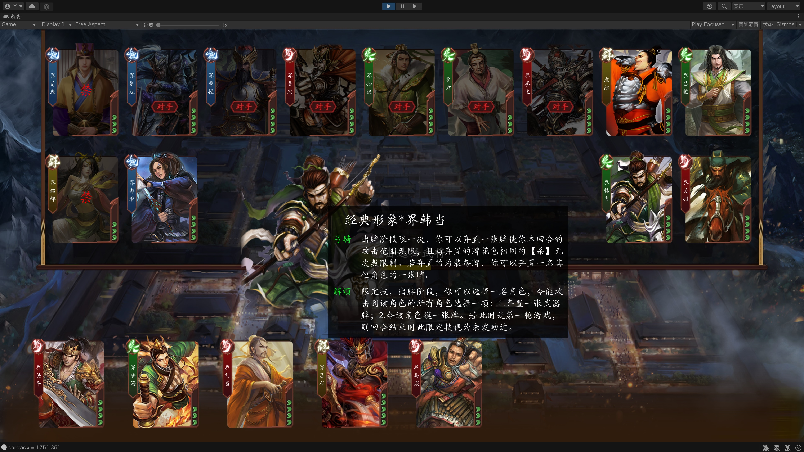
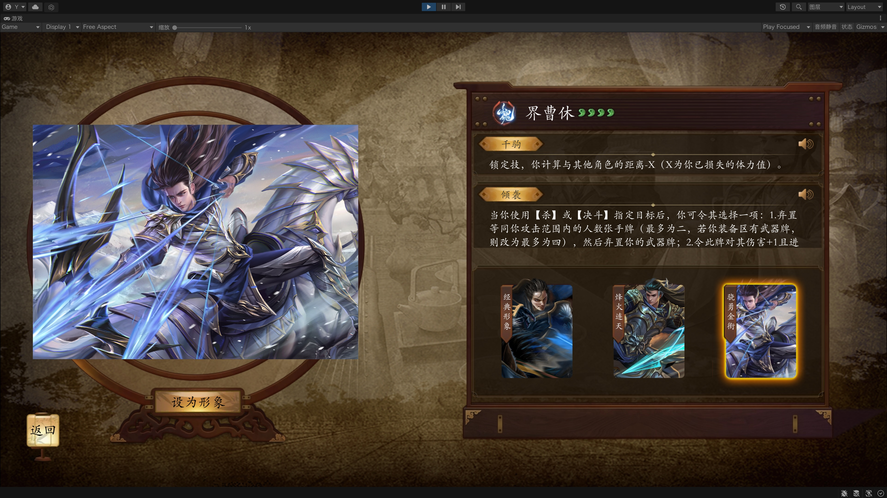
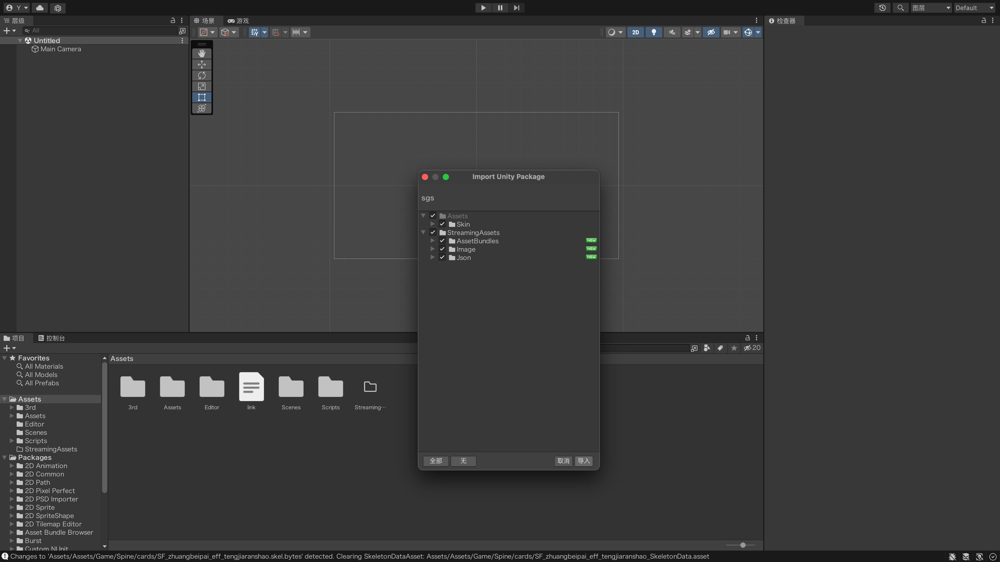
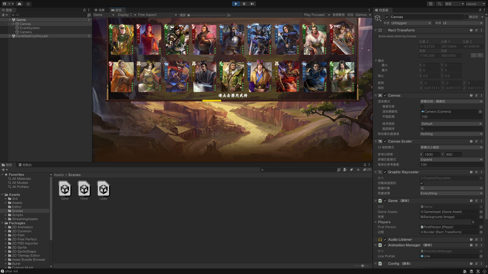

# Unity复刻《三国杀》

[演示视频](https://bilibili.com/video/BV1ua4y1N7m8) | [下载 (安卓)](https://mypikpak.com/s/VNrTSVJmDL7le14GPRDAS27Ko1/VNrRS57jsCnkbOZGqY1FtooKo1)

## 简介

本项目复刻了经典卡牌桌游《三国杀》，玩法类似于《三国杀》中的“统帅三军”模式，即双人对战，一人操作多名角色。游戏同时支持单机模式和联网模式，实现了BP系统、多人回合制、出牌系统、武将技能等核心游戏逻辑，以及注册登录、游戏大厅、房间系统等服务。

## 预览





## 快速开始

1. 开发环境: Unity2021.3.2f1c1

2. 下载源码:

   ```sh
   git clone https://github.com/wyx-0203/sgs-unity.git --depth 1
   ```

3. 用Unity打开项目，导入 [sgs.unitypackage](https://mypikpak.com/s/VNrTSVJmDL7le14GPRDAS27Ko1) (包含武将、皮肤等资源):

   

4. 进入`Game`场景，运行项目，即可开始游戏 (单机模式)

   

## 项目结构

### 概述

* 游戏由3个场景组成，分别是登录界面`Home`、大厅界面`Lobby`、游戏界面`Game`。

* 脚本部分分为4个程序集:

  1. `GameCore` : 游戏逻辑模块。

  2. `Skills` : 武将技能模块，依赖于`GameCore`。

  3. `Unity` : 视图模块，用于接收消息并更新游戏场景。

  4. `Model` : 模型模块，定义`GameCore`和`Unity`之间的各种消息体，通常会序列化为`json`。

  其中，`GameCore` 、`Skills`、 `Model` 都不包含Unity引擎代码，并作为类库项目被服务端程序引用。

* 调用`GameCore.Game`对象的`Run()`方法即开始一局游戏。单机模式下，进入场景时自动执行。联网模式下，由服务端执行。

* 所有卡牌、武将的基本信息，以`json`或`ScriptableObject`的形式存储在`StreamingAssets`中，

* 技能的具体实现写为`C#`脚本。

* 若要实现联网功能，需在服务器(或本地)运行服务端程序。本项目的服务端部分(暂未开源)使用`.Net Core`和`SignalR`实现房间系统，使用`Go`语言实现网关、鉴权等常规后端服务。服务之间通过`gRPC`通信。

### 重要的类

#### GameCore

* `Game` 游戏主类: 进入游戏场景时开始执行`async void Run()`，并由其调用BP系统、回合系统等，类似于`Main()`函数
* `BanPick` BP系统: 玩家将在BP阶段依次禁用一名武将，选择八名武将，最终挑选三名武将出战
* `CardPile` 牌堆
* `TurnSystem` 回合系统
* `GameOver` 游戏结束
* `PlayQuery` 出牌请求: 需要玩家操作时(如出牌、询问技能)，创建一个PlayQuery对象，并调用`async Task<Bool> Run()`函数，这将暂停当前线程，直到收到玩家操作后返回一个`PlayDecision`对象
* `Player` 玩家类
* `PlayerAction` 玩家行为基类: 例如摸牌、受到伤害等

* `Card` 卡牌基类
* `Skill` 技能基类

#### Unity

* `BanPick` BP界面

* `PlayArea` 操作区: 包括进度条、确认/取消等按钮，轮到自己操作时显示

* `CardArea` 手牌区

* `EquipArea` 装备区

* `SkillArea` 技能区

* `DestArea` 目标区

* `DiscardArea` 弃牌堆

* `CardPanel` 卡牌面板: 需要选中其他角色卡牌时显示，例如使用”过河拆桥“、“突袭”时

* `Audio` 音效

* `Player` 玩家

* `Card` 卡牌

* `CardSystem` 卡牌动画系统: 卡牌的位置由其父对象的位置和布局组决定，而通过这种方式只能瞬间移动卡牌，没有过渡效果。这里的解决方案是每张卡牌对应一个透明等长的`Target`对象，由`Target`在布局组中切换，卡牌实体则逐帧向`Target`靠近。

* `ABManager` AssetBundle管理器

* `Singleton` 单例模式基类

* `WebRequest` 向服务器发送HTTP请求，并返回响应

* `Connection` `SignalR`客户端，用于连接房间服务器

#### Model

- `HttpResponse` Http响应消息基类
- `Message` 游戏消息基类 (SignalR)
- `Card` 卡牌信息
- `General` 武将信息