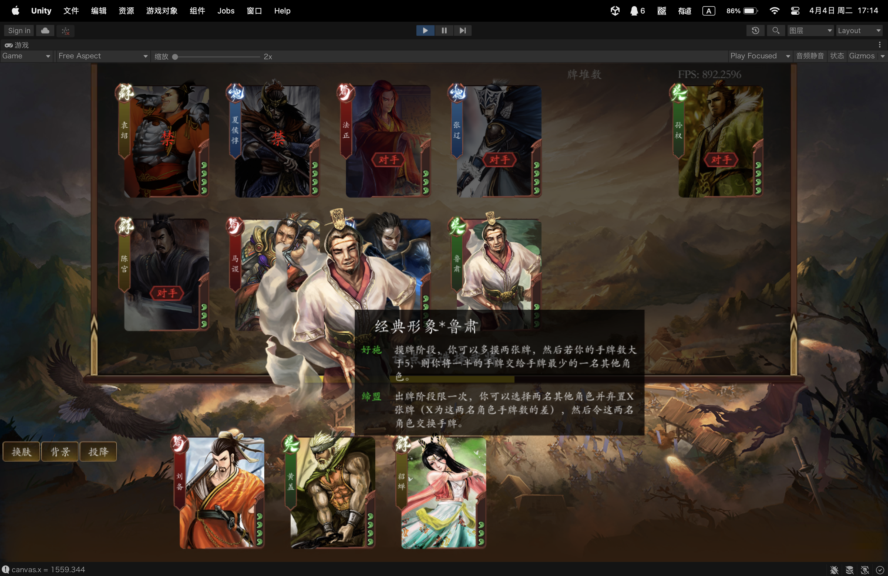
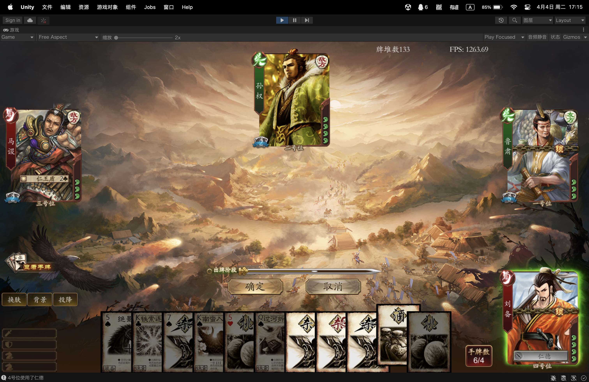
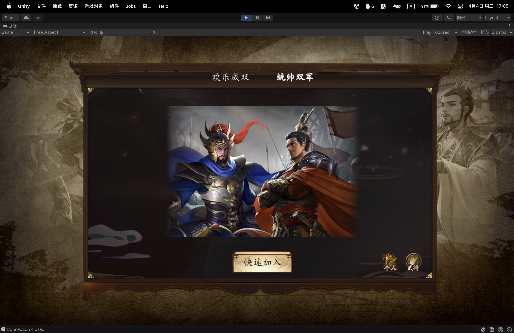
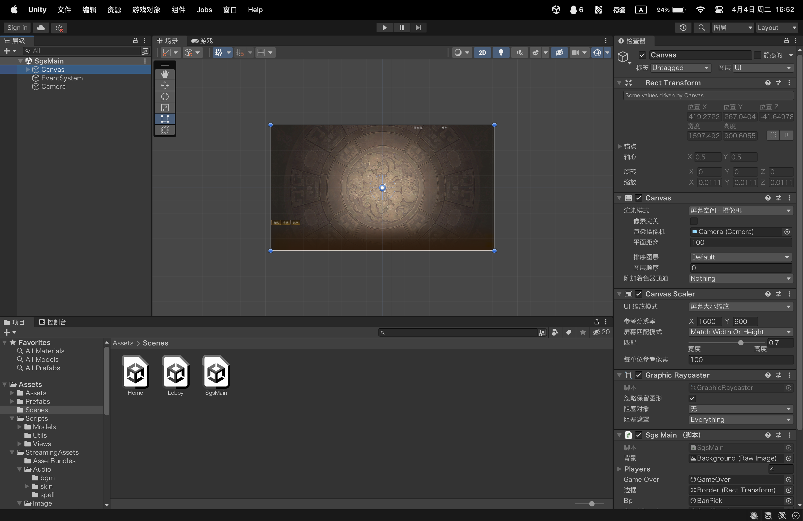
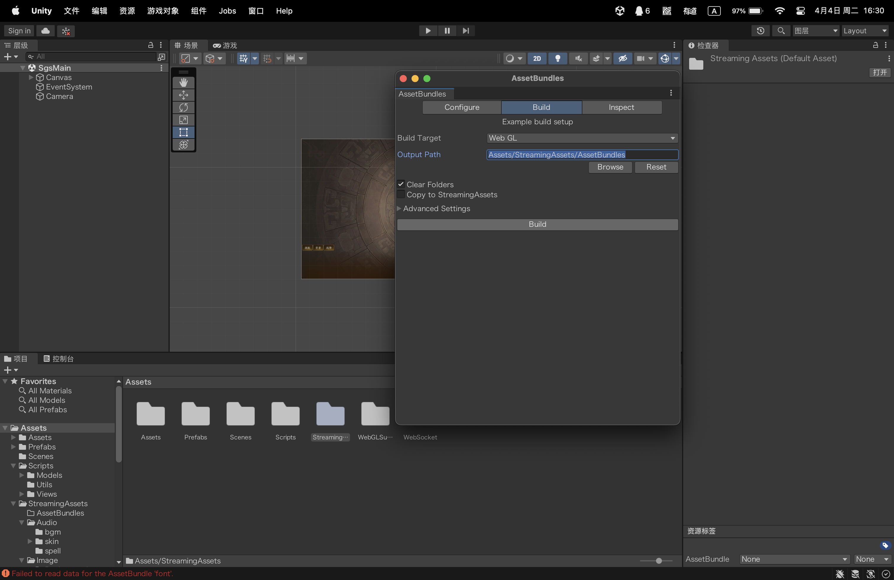

# Unity复刻《三国杀》

[游戏主页](https://app931.acapp.acwing.com.cn) | [演示视频](https://bilibili.com/video/BV1ua4y1N7m8) | [服务端](https://github.com/wyx-0203/sgs-server)

## 简介

本项目使用Unity引擎复刻了经典卡牌桌游《三国杀》，包括单机模式和联网模式，游戏以三国时期为背景，以武将为角色，以卡牌为形式，合纵连横，经过一轮一轮的谋略和动作获得最终的胜利。

## 预览





## 快速开始

1. 开发环境: Unity2021.3.2f1c1

2. 下载源码:

   ```sh
   git clone https://github.com/wyx-0203/sgs-unity.git
   ```

3. 用Unity打开项目，打开`SgsMain`场景:

   

4. 生成AssetBundle:

   在菜单栏中打开`窗口/AssetBundle Broser`，`Build Target`设为要发布的平台(例如WebGL)，`Output Path`设为`Assets/StreamingAssets/AssetBundles`，开始构建。

   

5. 开始运行

   

## 联网模式

若要实现联网功能，需在服务器(或本地)运行服务端程序，本项目的服务端部分使用Go语言开发，提供了用户系统、房间系统、游戏同步、部署WebGL等服务。[查看源码](https://github.com/wyx-0203/sgs-server)

## 项目结构

### 概述

* 游戏由3个场景组成，分别是登录界面`Home`、大厅界面`Lobby`、游戏界面`SgsMain`。

* 脚本部分分为模型层`Model`和视图层`View`。模型层维护游戏数据，执行游戏逻辑，并通过委托调用视图层。视图层则管理场景中所有的`GameObject`，以更新游戏界面。

* 每种耗时操作(如执行回合、使用牌、受到伤害等)都写成返回`Task`的函数(可等待)，配合`async/await`异步调用。

* 所有卡牌、武将的基本信息，以`json`形式存储在`StreamingAssets`中，技能的具体实现则写为C#脚本。
* 图片和音频存储在`StreamingAssets`中。
* 通过与服务器建立WebSocket连接，随时接收服务器广播的消息，以实现房间内多玩家同步的功能。

### 重要的类

#### Model

* `SgsMain` 游戏主类: 进入游戏场景时开始执行`async void Run()`，并由其调用BP系统、回合系统等，类似于`Main()`函数。
* `BanPick` BP系统: 玩家将在BP阶段依次禁用一名武将，选择五名武将，最终挑选两名武将出战。
* `CardPile` 牌堆
* `TurnSystem` 回合系统
* `GameOver` 游戏结束
* `Timer` 定时器: 需要等待玩家操作时(如出牌、询问技能)，调用`async Task<Bool> Run()`函数，这将暂停主线程直到倒计时结束，并保存玩家的操作信息(如指定的牌，指定的目标等)。
* `Player` 玩家类
* `PlayerAction` 玩家行为基类: 例如摸牌、受到伤害等，执行`async Task Execute()`函数，修改玩家数据并触发相应事件。

* `EventSet` 事件类: 例如回合开始时事件，受到伤害时事件等，通常用于触发技能，本质是存放函数的委托集合。

* `Card` 卡牌基类
* `Skill` 技能基类

#### View

* `SgsMain` View模块主类: 管理各种面板的显示/隐藏，以及玩家移动座位(统帅模式)。

* `BanPick` BP界面
* `OptionArea` 操作区: 包括进度条、确认/取消等按钮，轮到自己操作时显示。
* `CardArea` 手牌区
* `EquipArea` 装备区
* `SkillArea` 技能区
* `DestArea` 目标区
* `DiscardArea` 弃牌堆
* `CardPanel` 卡牌面板: 需要选中其他角色卡牌时显示，例如使用”过河拆桥“、“突袭”时。
* `Audio` 音效
* `Player` 玩家对象
* `Card` 卡牌对象
* `CardSystem` 卡牌动画系统: 卡牌的位置由其父对象的位置和布局组决定，而通过这种方式只能瞬间移动卡牌，没有过渡效果。这里的解决方案是每张卡牌对应一个透明等长的`Target`对象，由`Target`在布局组中切换，卡牌实体则逐帧向`Target`靠近。

#### Util

* `ABManager` AssetBundle管理器
* `Json` 定义各种可序列化对象，可转化为json字符串，用于发送和接收HTTP/WebSocket请求
* `Singleton` 单例模式基类
* `Url` 一些url常量
* `Util` 一些工具函数
* `WebRequest` 向服务器发送HTTP请求，并返回响应
* `WebSocket` 登录账号后与服务器建立并保持WebSocket连接